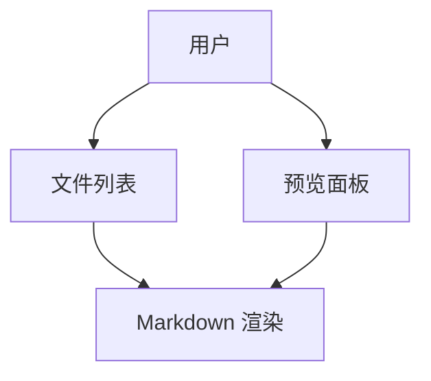

# mdwalker

AI agent 输出物专用终端 Markdown 工作台 — 在终端中快速浏览、导航、搜索 AI 生成的大量 .md 文件。

## 核心功能

- **双面板布局** — 左侧文件列表 + 右侧 Markdown 预览，支持鼠标点击和键盘操作
- **浮动大纲面板** — 按 `o` 打开/关闭，显示文档标题结构，Enter 跳转到对应位置
- **统一搜索** — 按 `/` 打开搜索，文件列表模式搜文件名，预览模式搜内容
- **树形文件视图** — 按 `t` 切换，按目录层级展示文件，j/k 按树形顺序移动
- **标题折叠** — 预览中按 `Space` 折叠/展开当前标题下的内容
- **Mermaid 图表** — 自动渲染 mermaid 代码块为图片（需安装 mmdc）
- **终端图片直显** — WezTerm / iTerm2 / Ghostty / Kitty 中原生显示图片（需安装 chafa 作为降级方案）
- **代码块操作** — 按 `y` 复制当前代码块到剪贴板
- **文件监听** — 自动检测目录变化，实时更新文件列表
- **历史导航** — 按 `b` 返回上一个打开的文件
- **目录白名单** — 自动发现 `.claude/`、`.agents/` 等 AI 工具目录中被 `.gitignore` 忽略的文档，排除 `*/skills/` 子目录

## 安装

### macOS

```bash
# Homebrew
brew tap bairea/tap
brew install mdwalker

# 或者 go install
go install github.com/bairea/mdwalker@latest
```

### Linux

```bash
go install github.com/bairea/mdwalker@latest
```

或者从 [GitHub Releases](https://github.com/Bairea/mdwalker/releases/latest) 下载对应架构的 tar.gz。

### Windows

```bash
# Scoop
scoop bucket add bairea https://github.com/Bairea/scoop-bucket
scoop install mdwalker

# 或者 go install
go install github.com/bairea/mdwalker@latest
```

也可以从 [GitHub Releases](https://github.com/Bairea/mdwalker/releases/latest) 下载 zip 解压后直接运行。

### 可选增强

| 工具 | 用途 | 安装 |
|------|------|------|
| mmdc | Mermaid 图表渲染 | `npm install -g @mermaid-js/mermaid-cli` |
| chafa | 终端图片渲染（降级） | `brew install chafa` |
| fd | 加速文件扫描 | `brew install fd` |

## 使用

```bash
mdwalker                  # 当前目录
mdwalker docs/            # 指定目录
mdwalker README.md        # 单文件预览
mdwalker --show-time      # 显示文件修改时间
mdwalker --no-watch       # 关闭文件监听
mdwalker --mermaid code   # Mermaid 只显示源码
```

## 快捷键

### 导航

| 按键 | 功能 |
|------|------|
| `j` / `k` / `↓` / `↑` | 当前面板内移动 |
| `h` / `←` | 焦点左移 |
| `l` / `→` | 焦点右移 |
| `Tab` | 文件列表 ↔ 预览快速切换 |
| `g` | 跳转到顶部 |
| `G` | 跳转到底部 |

### 文件操作

| 按键 | 功能 |
|------|------|
| `Enter` | 打开选中文件 |
| `t` | 文件栏切换树模式 / 列表模式 |
| `r` | 重新扫描目录 |
| `b` | 返回上一个文件 |

### 大纲

| 按键 | 功能 |
|------|------|
| `o` | 打开 / 关闭大纲面板 |
| `Enter` | 跳转到选中标题（焦点保留在大纲） |

### 搜索

| 按键 | 功能 |
|------|------|
| `/` | 打开搜索（文件栏搜文件名，预览搜内容） |
| `n` / `N` | 下一个 / 上一个匹配 |
| `Enter` | 打开匹配文件或跳转到匹配行 |
| `Esc` | 关闭搜索 |

### 内容操作

| 按键 | 功能 |
|------|------|
| `Space` | 折叠 / 展开标题内容 |
| `y` | 复制当前代码块 |
| `i` | 用默认程序打开光标处的图片 |

### 全局

| 按键 | 功能 |
|------|------|
| `q` / `Ctrl+C` | 退出 |
| 鼠标左键 | 点击文件列表打开文件、点击大纲跳转标题 |

## 录制终端演示 (VHS)

使用 [VHS](https://github.com/charmbracelet/vhs) 录制 `.tape` 文件生成 GIF。

### 准备测试数据

```bash
mkdir -p demo/docs
cat > demo/docs/overview.md << 'EOF'
# 项目概览

## 背景

这是一个演示项目，展示 mdwalker 的核心功能。

## 目标

- 快速浏览 AI 生成的文档
- 高效的标题导航
- 支持代码块和图表

## 架构


EOF

cat > demo/docs/api.md << 'EOF'
# API 文档

## 接口列表

### GET /users

获取用户列表。

```go
func GetUsers() ([]User, error) {
    return db.Query("SELECT * FROM users")
}
```

### POST /users

创建新用户。

```bash
curl -X POST /users -d '{"name": "test"}'
```

## 错误码

| 码 | 含义 |
|----|------|
| 200 | 成功 |
| 400 | 参数错误 |
| 500 | 服务器错误 |
EOF

for i in $(seq 1 8); do
cat > "demo/docs/note-${i}.md" << EOF
# 笔记 ${i}

## 摘要

这是第 ${i} 篇笔记的内容摘要。

## 详细内容

这里包含了一些需要折叠查看的详细内容。

- 要点 A
- 要点 B
- 要点 C

### 子标题 ${i}.1

更深层次的内容结构。
EOF
done
```

### VHS tape 脚本

创建 `demo.tape`：

```tape
Output demo.gif
Set Theme "Catppuccin Mocha"
Set Width 1200
Set Height 800
Set FontSize 16
Set Padding 60
Set Margin 60

# 启动 mdwalker
Type "mdwalker demo/docs/"
Enter
Sleep 2s

# 上下移动浏览文件，预览跟着变化
Down
Sleep 300ms
Down
Sleep 300ms
Down
Sleep 300ms

# 打开树形模式
Type "t"
Sleep 500ms

# 在树形模式下移动
Down
Sleep 300ms
Down
Sleep 300ms

# 打开文件
Enter
Sleep 1s

# 打开大纲面板
Type "o"
Sleep 500ms

# 在大纲中导航并跳转
Down
Enter
Sleep 800ms
Down
Enter
Sleep 800ms

# 按 / 搜索内容
Type "/"
Sleep 300ms
Type "error"
Sleep 500ms

# 浏览匹配项
Type "n"
Sleep 300ms
Type "n"
Sleep 300ms

# 关闭搜索
Escape
Sleep 300ms

# 返回列表，打开另一个文件
Type "h"
Sleep 200ms
Down
Down
Enter
Sleep 800ms

# 折叠标题
Space
Sleep 500ms

# 退出
Type "q"
Sleep 500ms
```

### 生成 GIF

```bash
vhs demo.tape
```

建议录制的关键场景：
1. 文件列表上下移动 + 预览实时更新
2. 树形模式切换与导航
3. 大纲面板打开 → 选中标题 → Enter 跳转
4. `/` 搜索内容 → `n` 浏览匹配
5. `Space` 折叠标题
6. `b` 返回上一个文件

## 配置

### config.toml

`~/.config/mdwalker/config.toml`：

```toml
# 图片协议: auto, kitty, halfblock, off
image_protocol = "auto"

# Mermaid 模式: auto, code, browser
mermaid_mode = "auto"

# mmdc 路径
mmdc_path = "mmdc"

# 显示文件修改时间（默认 false）
show_time = false
```

### whitelist.yaml

`~/.config/mdwalker/whitelist.yaml`（全局）和项目根目录 `mdwalker-whitelist.yaml`（可选，与全局合并）：

```yaml
# 被 .gitignore 但需要 mdwalker 扫描的目录
unignore:
  dot_dirs:    # 隐藏 AI 工具目录
    - .claude
    - .agents
  paths:       # 普通目录
    - docs/superpowers
  files:       # 单独文件
    - AGENTS.md
    - CLAUDE.md

# unignore 扫描时跳过的子目录
skip_subdirs:
  - "*/skills"
```

内置默认值覆盖 31 个 AI 工具的 `.X` 目录（`.claude`、`.agents`、`.pi`、`.trae`、`.augment`、`.windsurf` 等），无需手动配置即可使用。
