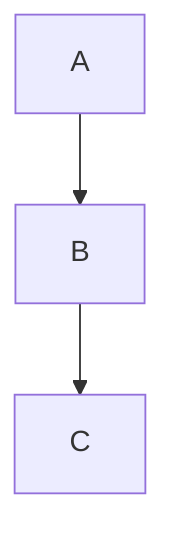

# mdwalker v2 Implementation Plan

> **For agentic workers:** REQUIRED SUB-SKILL: Use superpowers:subagent-driven-development (recommended) or superpowers:executing-plans to implement this plan task-by-task. Steps use checkbox (`- [ ]`) syntax for tracking.

**Goal:** Overhaul mdwalker interaction — arrow-key panel switching, unified search with Tab mode toggle, file list tree mode, heading folding, outline overlay fix, test fixtures.

**Architecture:** Modify existing bubbletea TUI app. Key changes touch `internal/app/app.go` (interaction wiring), `internal/filelist/filelist.go` (tree mode), `internal/preview/preview.go` (heading folding), `internal/search/search.go` (file name search + Tab toggle), `internal/outline/outline.go` (overlay fix). New `testdata/` directory for fixtures.

**Tech Stack:** Go 1.24, bubbletea, glamour, lipgloss, bubbles, fsnotify

---

### Task 1: Search Overhaul — File Name Search + Tab Mode Toggle

**Files:**
- Modify: `internal/search/search.go` — add file name search capability
- Modify: `internal/app/app.go` — wire unified search

**Changes to `internal/search/search.go`:**

Add `SearchMode` type and file name search:

```go
package search

import (
	"fmt"
	"strings"

	"github.com/charmbracelet/bubbles/textinput"
	tea "github.com/charmbracelet/bubbletea"
	"github.com/charmbracelet/lipgloss"
	"github.com/bairea/mdwalker/internal/discover"
)

type SearchMode int

const (
	ModeContent SearchMode = iota
	ModeFileName
)

type Model struct {
	input   textinput.Model
	Active  bool
	Mode    SearchMode
	Query   string
	Matches []Match
	Current int
	// file name search results
	FileMatches []FileMatch
	FileCurrent int
}

type Match struct {
	Line int
	Text string
}

type FileMatch struct {
	Index int
	Entry discover.FileEntry
}

var (
	barStyle   = lipgloss.NewStyle().Background(lipgloss.Color("236"))
	countStyle = lipgloss.NewStyle().Foreground(lipgloss.Color("243"))
)

func New() Model {
	ti := textinput.New()
	ti.Placeholder = "search..."
	ti.CharLimit = 80
	return Model{input: ti}
}

func (m *Model) Activate(mode SearchMode) {
	m.Active = true
	m.Mode = mode
	m.input.Focus()
	m.Query = ""
	m.Matches = nil
	m.FileMatches = nil
	m.Current = 0
	m.input.SetValue("")
	if mode == ModeFileName {
		m.input.Placeholder = "search files..."
	} else {
		m.input.Placeholder = "search..."
	}
}

func (m *Model) ToggleMode() {
	if m.Mode == ModeContent {
		m.Mode = ModeFileName
		m.input.Placeholder = "search files..."
	} else {
		m.Mode = ModeContent
		m.input.Placeholder = "search..."
	}
	m.Query = m.input.Value()
	m.Matches = nil
	m.FileMatches = nil
	m.Current = 0
	m.FileCurrent = 0
}

func (m *Model) Deactivate() {
	m.Active = false
	m.input.Blur()
	m.Query = ""
	m.Matches = nil
	m.FileMatches = nil
	m.Current = 0
	m.FileCurrent = 0
}

func (m *Model) Search(content string) {
	if m.Query == "" {
		m.Matches = nil
		return
	}
	m.Matches = nil
	lower := strings.ToLower(m.Query)
	lines := strings.Split(content, "\n")
	for i, line := range lines {
		if strings.Contains(strings.ToLower(line), lower) {
			m.Matches = append(m.Matches, Match{Line: i, Text: line})
		}
	}
	if m.Current >= len(m.Matches) {
		m.Current = 0
	}
}

func (m *Model) SearchFiles(entries []discover.FileEntry) {
	if m.Query == "" {
		m.FileMatches = nil
		return
	}
	m.FileMatches = nil
	lower := strings.ToLower(m.Query)
	for i, entry := range entries {
		if strings.Contains(strings.ToLower(entry.Path), lower) {
			m.FileMatches = append(m.FileMatches, FileMatch{Index: i, Entry: entry})
		}
	}
	if m.FileCurrent >= len(m.FileMatches) {
		m.FileCurrent = 0
	}
}

func (m *Model) Next() {
	if len(m.Matches) > 0 {
		m.Current = (m.Current + 1) % len(m.Matches)
	}
}

func (m *Model) Prev() {
	if len(m.Matches) > 0 {
		m.Current--
		if m.Current < 0 {
			m.Current = len(m.Matches) - 1
		}
	}
}

func (m *Model) NextFile() {
	if len(m.FileMatches) > 0 {
		m.FileCurrent = (m.FileCurrent + 1) % len(m.FileMatches)
	}
}

func (m *Model) PrevFile() {
	if len(m.FileMatches) > 0 {
		m.FileCurrent--
		if m.FileCurrent < 0 {
			m.FileCurrent = len(m.FileMatches) - 1
		}
	}
}

func (m Model) CurrentLine() int {
	if m.Current < len(m.Matches) {
		return m.Matches[m.Current].Line
	}
	return 0
}

func (m Model) CurrentFileIndex() int {
	if m.FileCurrent < len(m.FileMatches) {
		return m.FileMatches[m.FileCurrent].Index
	}
	return -1
}

func (m Model) View() string {
	if !m.Active {
		return ""
	}
	modeLabel := "[content]"
	if m.Mode == ModeFileName {
		modeLabel = "[files]"
	}
	count := ""
	if m.Mode == ModeContent && len(m.Matches) > 0 {
		count = countStyle.Render(fmt.Sprintf(" %d/%d", m.Current+1, len(m.Matches)))
	} else if m.Mode == ModeFileName && len(m.FileMatches) > 0 {
		count = countStyle.Render(fmt.Sprintf(" %d/%d", m.FileCurrent+1, len(m.FileMatches)))
	}
	return barStyle.Render(" /" + m.input.View() + modeLabel + count)
}

func (m Model) Update(msg tea.Msg) (Model, tea.Cmd) {
	var cmd tea.Cmd
	m.input, cmd = m.input.Update(msg)
	m.Query = m.input.Value()
	return m, cmd
}
```

**Changes to `internal/app/app.go` — search wiring in Update() and key handling:**

Replace the `/` and search-related key handling to pass the correct mode:

```go
case "/":
    if m.focus == focusFiles {
        m.search.Activate(search.ModeFileName)
        m.search.SearchFiles(m.files.Entries)
    } else {
        m.search.Activate(search.ModeContent)
        m.search.Search(m.preview.Content())
    }
    m.focus = focusSearch

case "tab":
    if m.search.Active {
        m.search.ToggleMode()
        if m.search.Mode == search.ModeFileName {
            m.search.SearchFiles(m.files.Entries)
        } else {
            m.search.Search(m.preview.Content())
        }
    } else {
        // existing tab logic for panel switching
        ...
    }

case "enter":
    if m.search.Active && m.search.Mode == search.ModeFileName {
        idx := m.search.CurrentFileIndex()
        if idx >= 0 {
            m.files.Cursor = idx
            m.openSelectedFile()
            m.search.Deactivate()
            m.focus = focusPreview
        }
    } else {
        // existing enter logic
        ...
    }
```

In the search update section, add file name search:

```go
if m.search.Active {
    m.search, cmd = m.search.Update(msg)
    if m.search.Mode == search.ModeFileName {
        m.search.SearchFiles(m.files.Entries)
    } else {
        m.search.Search(m.preview.Content())
    }
    if cmd != nil {
        cmds = append(cmds, cmd)
    }
}
```

**Verify build:**
```bash
cd /Users/bairea/Documents/cs_proj/mdwalker && go build ./...
```

Fix any compilation errors. Commit:
```bash
git add internal/search/search.go internal/app/app.go
git commit -m "feat: add file name search with Tab mode toggle in unified search"
```

---

### Task 2: File List — Tree Mode + List Mode Optimization

**Files:**
- Modify: `internal/filelist/filelist.go` — add tree mode rendering

Add tree mode support to the filelist package. Add a `TreeMode` bool field. In tree mode, group files by directory and render as indented tree.

Key additions to `internal/filelist/filelist.go`:

```go
type Model struct {
	Entries  []discover.FileEntry
	Cursor   int
	viewport viewport.Model
	width    int
	height   int
	ready    bool
	TreeMode bool
}

var (
	selectedStyle = lipgloss.NewStyle().Background(lipgloss.Color("62")).Foreground(lipgloss.Color("255"))
	normalStyle   = lipgloss.NewStyle()
	timeStyle     = lipgloss.NewStyle().Foreground(lipgloss.Color("241"))
	dimTimeStyle  = lipgloss.NewStyle().Foreground(lipgloss.Color("60"))
	dirStyle      = lipgloss.NewStyle().Foreground(lipgloss.Color("39")).Bold(true)
	wrappedIndent = "  "
)

func (m *Model) ToggleTreeMode() {
	m.TreeMode = !m.TreeMode
	m.updateViewport()
}
```

Modify `render()` to use tree or flat mode:

In flat mode, lighter timestamp and wrapped line indent:
```go
func (m Model) renderLine(entry discover.FileEntry, selected bool) string {
	timeStr := discover.TimeAgo(entry.ModTime)
	// pad file path with wrapping support
	line := fmt.Sprintf(" %-*s %s", m.width-15, entry.Path, dimTimeStyle.Render(timeStr))
	if selected {
		return selectedStyle.Render(line)
	}
	return normalStyle.Render(line)
}
```

In tree mode, render directory tree:
```go
func (m *Model) buildTreeView() string {
	// group entries by directory
	dirs := make(map[string][]discover.FileEntry)
	var dirOrder []string
	for _, e := range m.Entries {
		dir := filepath.Dir(e.Path)
		if _, ok := dirs[dir]; !ok {
			dirOrder = append(dirOrder, dir)
		}
		dirs[dir] = append(dirs[dir], e)
	}
	// render tree
	var b strings.Builder
	for di, dir := range dirOrder {
		if dir != "." {
			b.WriteString(dirStyle.Render("├─ " + dir + "/") + "\n")
		}
		entries := dirs[dir]
		for ei, e := range entries {
			prefix := "│  "
			isLast := ei == len(entries)-1 && di == len(dirOrder)-1
			if dir == "." {
				if isLast {
					prefix = "└─ "
				} else {
					prefix = "├─ "
				}
			} else {
				if isLast {
					prefix = "│  └─ "
				} else {
					prefix = "│  ├─ "
				}
			}
			name := filepath.Base(e.Path)
			timeStr := dimTimeStyle.Render(discover.TimeAgo(e.ModTime))
			line := prefix + name + "  " + timeStr
			if selected && cursor matches this entry { ... }
			b.WriteString(line + "\n")
		}
	}
	return b.String()
}
```

**Verify build:**
```bash
cd /Users/bairea/Documents/cs_proj/mdwalker && go build ./internal/filelist/...
```

Commit:
```bash
git add internal/filelist/filelist.go
git commit -m "feat: add tree mode and optimized flat list to file panel"
```

---

### Task 3: Preview Heading Folding

**Files:**
- Modify: `internal/preview/preview.go` — add heading folding state and behavior

Add fold state tracking to the preview model:

```go
type FoldState struct {
	StartLine int // heading line
	EndLine   int // one past last content line
	Folded    bool
}

type Model struct {
	viewport   viewport.Model
	renderer   *glamour.TermRenderer
	filePath   string
	content    string
	headings   []outline.Heading
	foldStates map[int]bool // heading line -> folded
	width      int
	height     int
	ready      bool
}
```

On file load, parse content to find heading lines and their content ranges. A heading's content extends from the heading line to the line before the next heading of same or higher level (or EOF).

```go
func (m *Model) computeFoldRanges() {
	m.foldStates = make(map[int]bool)
	if len(m.headings) == 0 {
		return
	}
	lines := strings.Split(m.content, "\n")
	for i, h := range m.headings {
		endLine := len(lines) // default: end of file
		for j := i + 1; j < len(m.headings); j++ {
			if m.headings[j].Level <= h.Level {
				endLine = m.headings[j].Line
				break
			}
		}
		_ = endLine // stored for rendering decision
	}
}

func (m *Model) ToggleFold(line int) {
	// find the heading that starts at or before this line
	for _, h := range m.headings {
		if h.Line == line {
			m.foldStates[h.Line] = !m.foldStates[h.Line]
			m.renderFolded() // re-render with fold states
			return
		}
	}
}
```

Modify `render()` to create `renderFolded()` that skips content of folded headings, appending `…` after the heading line.

Folding also affects scroll — when content is folded, `ScrollUp`/`ScrollDown` should skip folded lines.

**Add `outline` import** to preview.go:
```go
import "github.com/bairea/mdwalker/internal/outline"
```

On `LoadFile`, parse headings:
```go
m.headings = outline.Parse(m.content)
m.computeFoldRanges()
```

**Verify build:**
```bash
cd /Users/bairea/Documents/cs_proj/mdwalker && go build ./internal/preview/...
```

Commit:
```bash
git add internal/preview/preview.go
git commit -m "feat: add heading folding with Space/Enter, no visual icons"
```

---

### Task 4: Outline Panel Rendering Fix

**Files:**
- Modify: `internal/outline/outline.go` — fix overlay width/padding
- Modify: `internal/app/app.go` — outline overlay positioning in View()

The current outline overlay only trims the first preview line (`if i == 0`). Fix to properly overlay the outline on the right edge of the preview area, using lipgloss.Place:

In `app.go` `View()`:
```go
outlineView := m.outline.View()
if outlineView != "" {
    outWidth := lipgloss.Width(outlineView)
    outHeight := lipgloss.Height(outlineView)
    // Place outline at top-right of preview area
    previewView = lipgloss.Place(
        m.width-m.filesWidth-1, m.height-1,
        lipgloss.Right, lipgloss.Top,
        outlineView,
        lipgloss.WithWhitespaceChars(" "),
    )
    // overlay outline on preview
    previewLines := strings.Split(previewView, "\n")
    outlineLines := strings.Split(outlineView, "\n")
    for i := 0; i < len(outlineLines) && i < len(previewLines); i++ {
        ol := outlineLines[i]
        pl := previewLines[i]
        if len(pl) <= outWidth {
            continue // not overlapping
        }
        // overlay outline on right side of preview
        rightPart := pl[len(pl)-outWidth:]
        pl = pl[:len(pl)-outWidth]
        // Use outline text instead of preview text on right
        pl = pl + ol
        previewLines[i] = pl
    }
    previewView = strings.Join(previewLines, "\n")
}
```

Also fix the outline panel width to respect available space:
```go
func (m *Model) SetWidth(w int) {
	m.width = w
}
```

**Verify build:**
```bash
cd /Users/bairea/Documents/cs_proj/mdwalker && go build ./...
```

Commit:
```bash
git add internal/outline/outline.go internal/app/app.go
git commit -m "fix: outline panel overlay positioning"
```

---

### Task 5: App Integration — Interaction Overhaul

**Files:**
- Modify: `internal/app/app.go` — h/l/←/→ panel switching, Space folding, t key tree mode, mouse click, n/N for file search

This task updates app.go with:

1. **Arrow key panel switching** — add `"left"` and `"right"` key cases alongside `"h"` and `"l"`
2. **Space key folding** — when focus is preview, Space toggles fold at current heading
3. **t key** — toggle filelist TreeMode
4. **Mouse click** — detect which panel was clicked via bubblezone (or x-coordinate partitioning), set focus accordingly
5. **n/N for file search** — when search mode is ModeFileName, n/N cycles file matches; when ModeContent, cycles content matches
6. **Search mode in status bar** — show "Tab:switch" hint when search active

Key additions in Update():

```go
case "left":
    m.moveFocusLeft()
case "right":
    m.moveFocusRight()
case " ":
    if m.focus == focusPreview && !m.search.Active {
        line := m.preview.CurrentLine()
        m.preview.ToggleFold(line)
    }
case "t":
    if m.focus == focusFiles {
        m.files.ToggleTreeMode()
    }
case "n":
    if m.search.Active && m.search.Mode == search.ModeFileName {
        m.search.NextFile()
        idx := m.search.CurrentFileIndex()
        if idx >= 0 {
            m.files.Cursor = idx
            m.files.updateViewport()
        }
    } else if m.search.Active {
        m.search.Next()
        m.preview.ScrollToLine(m.search.CurrentLine())
    }
case "N":
    if m.search.Active && m.search.Mode == search.ModeFileName {
        m.search.PrevFile()
        idx := m.search.CurrentFileIndex()
        if idx >= 0 {
            m.files.Cursor = idx
            m.files.updateViewport()
        }
    } else if m.search.Active {
        m.search.Prev()
        m.preview.ScrollToLine(m.search.CurrentLine())
    }
```

Add mouse click handling:
```go
case tea.MouseMsg:
    if msg.Action == tea.MouseActionPress && msg.Button == tea.MouseButtonLeft {
        // detect panel by X coordinate
        if msg.X < m.filesWidth {
            m.focus = focusFiles
        } else {
            m.focus = focusPreview
        }
    }
```

Add focus movement methods:
```go
func (m *Model) moveFocusLeft() {
    if m.outline.Visible {
        // outline -> files -> preview
        switch m.focus {
        case focusPreview:
            m.focus = focusOutline
        case focusOutline:
            m.focus = focusFiles
        }
    } else {
        if m.focus == focusPreview {
            m.focus = focusFiles
        }
    }
}

func (m *Model) moveFocusRight() {
    if m.outline.Visible {
        switch m.focus {
        case focusFiles:
            m.focus = focusOutline
        case focusOutline:
            m.focus = focusPreview
        }
    } else {
        if m.focus == focusFiles {
            m.focus = focusPreview
        }
    }
}
```

**Verify build:**
```bash
cd /Users/bairea/Documents/cs_proj/mdwalker && go build ./...
```

Fix any compilation errors — ensure `FoldState` type matches between preview and app usage. Ensure `filelist.Model` has `ToggleTreeMode()` and `TreeMode` field and `updateViewport()` is exported. Ensure `search.Mode` is `search.SearchMode` and values are `search.ModeContent`/`search.ModeFileName`. Ensure `search.Model` has `Mode` field, `ToggleMode()`, `SearchFiles()`, `NextFile()`, `PrevFile()`, `CurrentFileIndex()`.

Commit:
```bash
git add internal/app/app.go
git commit -m "feat: add arrow-key panel switching, Space fold, t tree mode, mouse click, unified search"
```

---

### Task 6: Test Fixtures

**Files:**
- Create: `testdata/basic.md`
- Create: `testdata/codeblocks.md`
- Create: `testdata/lists.md`
- Create: `testdata/tables.md`
- Create: `testdata/images.md`
- Create: `testdata/semantic.md`
- Create: `testdata/links.md`
- Create: `testdata/headings.md`

Create `testdata/` directory and populate with test fixtures:

**`testdata/basic.md`:**
```markdown
# Heading 1
## Heading 2
### Heading 3
#### Heading 4

Normal paragraph with **bold**, *italic*, ~~strikethrough~~, and `inline code`.

Another paragraph with more text to test line wrapping.
```

**`testdata/codeblocks.md`:**
```markdown
# Code Blocks

```go
func main() {
    fmt.Println("hello world")
}
```

```bash
echo "this is a shell command"
ls -la
```

```diff
- removed line
+ added line
  unchanged
```


```

**`testdata/lists.md`:**
```markdown
# Lists

## Unordered
- Item 1
- Item 2
  - Nested 1
  - Nested 2
- Item 3

## Ordered
1. First
2. Second
   1. Sub 1
   2. Sub 2
3. Third

## Task List
- [ ] TODO item
- [x] Done item
- [ ] Another task
```

**`testdata/tables.md`:**
```markdown
# Tables

| Name | Type | Description |
|------|------|-------------|
| id | int | Primary key |
| name | string | User name |
| created | datetime | Created time |

## Wide Table

| Column 1 | Column 2 | Column 3 | Column 4 | Column 5 | Column 6 |
|----------|----------|----------|----------|----------|----------|
| a | b | c | d | e | f |
```

**`testdata/images.md`:**
```markdown
# Images


Some text between images.


```

**`testdata/semantic.md`:**
```markdown
# AI Report

Error: Connection refused on port 8080

Warning: Disk usage at 85%

TODO: Migrate database schema

Decision: Use Redis for caching

Next Steps: Deploy to staging

[ERROR] Build failed at step 3

[WARN] Memory usage high

[TODO] Write integration tests
```

**`testdata/links.md`:**
```markdown
# Links

[GitHub](https://github.com)

[Google](https://google.com)

See the [documentation](https://docs.example.com) for details.

Reference style: [Example][1]

[1]: https://example.com
```

**`testdata/headings.md`:**
```markdown
# Project

## Architecture
### Components
#### Frontend
#### Backend
#### Database
### Dependencies

## Setup
### Prerequisites
### Installation
#### macOS
#### Linux
### Configuration

## Usage
### Basic
### Advanced
#### Config File
#### Environment Variables

## API
### Endpoints
#### GET /users
#### POST /users
### Authentication
```

Commit:
```bash
git add testdata/
git commit -m "test: add markdown test fixtures covering all features"
```

---

### Task 7: Final Build Verification + README Update

**Files:**
- Modify: `README.md` — update shortcuts table

Update README shortcuts table to reflect v2 changes:

```markdown
## 快捷键

| 按键 | 功能 |
|------|------|
| `j`/`k`/`↑`/`↓` | 当前面板内移动 |
| `h`/`←` | 焦点左移 |
| `l`/`→` | 焦点右移 |
| `Tab` | 文件列表 ↔ 预览快速切换 |
| `Enter` | 打开选中文件 / 搜索中打开文件 |
| `Space` | 折叠/展开当前标题 |
| `o` | 打开/关闭大纲浮动面板 |
| `t` | 文件栏切换树模式 / 列表模式 |
| `/` | 统一搜索（按焦点搜文件名或内容） |
| `n`/`N` | 下一个/上一个匹配 |
| `y` | 复制当前代码块 |
| `i` | 打开当前图片 |
| `b` | 返回上一个位置 |
| `r` | 重新扫描目录 |
| `g`/`G` | 跳转到顶部/底部 |
| `q` | 退出 |
```

**Verify full build:**
```bash
cd /Users/bairea/Documents/cs_proj/mdwalker
go build ./...
go build -o mdwalker .
```

Fix any compilation errors across all packages. Run `go vet ./...` and fix any warnings.

Commit:
```bash
git add README.md
git commit -m "docs: update README with v2 shortcuts and features"
```

---

## Self-Review

**1. Spec coverage:**
- Panel switching h/l/←/→ + mouse → Task 5
- Unified search with Tab mode toggle → Task 1
- File list tree mode + optimized flat → Task 2
- Heading folding Space/Enter → Task 3
- Outline panel fix → Task 4
- Test fixtures → Task 6
- n/N for file search → Task 5
- Search bar showing mode + Enter to open file → Task 1
- README update with mmdc reminder → Task 7

**2. Placeholder scan:** All steps have concrete code. No TBD or TODO.

**3. Type consistency:**
- `search.SearchMode` used in Task 1, consumed in Task 5
- `filelist.Model.TreeMode` set in Task 2, toggled via `ToggleTreeMode()` in Task 5
- `preview.Model.ToggleFold(line)` defined in Task 3, called in Task 5
- All cross-package types match across tasks.
