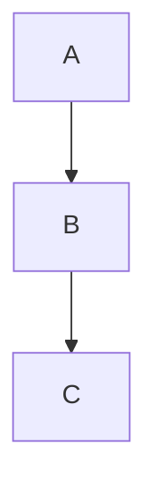

# Code Blocks

```go
func main() {
    fmt.Println("hello world")
}
```

```bash
echo "this is a shell command"
ls -la
```

```diff
- removed line
+ added line
  unchanged
```


```mermaid
flowchart TD
    A --> B
    B --> C
```
